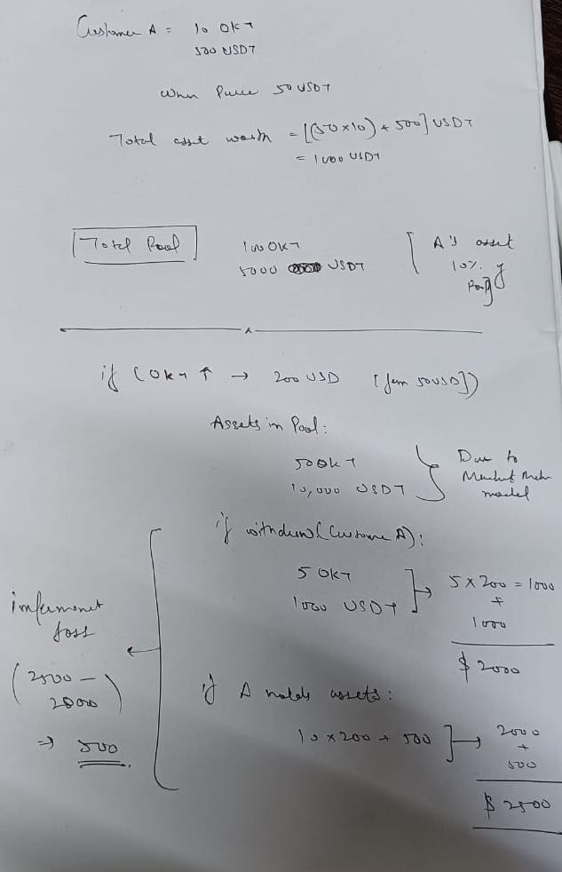

# ImpermanentLoss-UniswapV3-Bot 🤖

Here we were given a task to exit a liquidity pool when impermanent loss is (>50%) by deploying a smart contract which will trigger the exitLiquidity function which we made and will transfer our funds back into the wallet.

(Original task given at : /ProblemStatement.md)

**Tech Used :**

- Javascript
- Ether.js
- Solidity
- Hardhat
- UniswapV3 subgraph

**To Deploy the contract :**

```
cd SmartContract
npm i
npx hardhat run scripts/deploy.js
```

**To run the application :**

```
We need to first edit the config file with all the params :

cd config
nano config.js

Install all the packages

cd ..
yarn add
node index.js
```

**Contract is getting compiled and deployed without any errors**
</img>

**What is impermanent loss ?**

</img>
